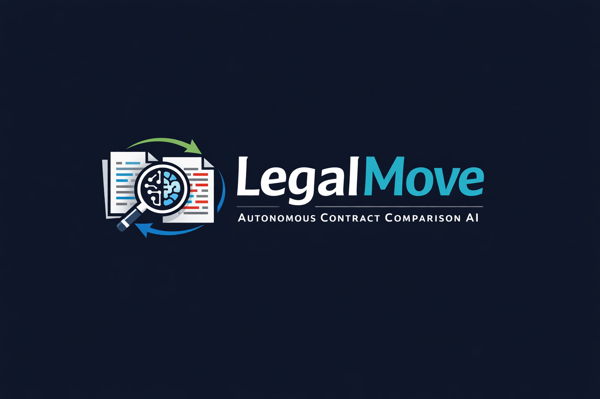
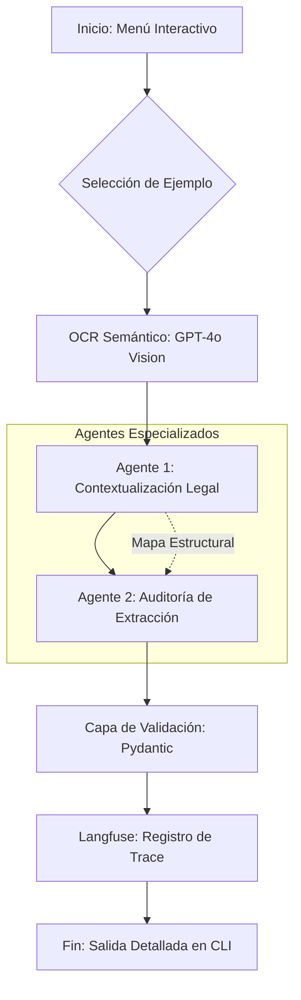

# 

# ⚖️ LegalMove | Contract Intelligence Pipeline


Este proyecto implementa un pipeline de agentes multimodales para la **auditoría y detección de modificaciones en contratos legales**. El sistema utiliza agentes especializados para comparar contratos originales contra sus enmiendas, extrayendo cambios a nivel de cláusula con validación estricta y trazabilidad completa.

---

## 🏗️ Arquitectura del Sistema

El sistema sigue un diseño de **Agentes Especializados y Secuenciales**, donde la salida de cada etapa enriquece la siguiente.

### Diagrama de Flujo y Orquestación



---

## 🧩 Responsabilidades por Componente

| Módulo                               | Responsabilidad                                                                   | Tecnología    |
| :----------------------------------- | :-------------------------------------------------------------------------------- | :------------ |
| **`src/main.py`**                    | Orquestador principal, gestión de trazas en Langfuse y menú interactivo.          | Python        |
| **`src/image_parser.py`**            | Extracción visual y semántica de texto desde imágenes/PDFs.                       | GPT-4o Vision |
| **`src/agents/context_agent.py`**    | Analista Senior que mapea la estructura y propósito de las cláusulas.             | GPT-4o        |
| **`src/agents/extraction_agent.py`** | Auditor Legal que realiza la comparación delta (mod/add/del) a nivel de cláusula. | GPT-4o        |
| **`src/models.py`**                  | Definición de esquemas estrictos y lógica de validación de datos.                 | Pydantic V2   |

---

## 🕵️ Observabilidad Avanzada (Langfuse)

El sistema integra **Langfuse** para proporcionar una trazabilidad completa de cada ejecución, permitiendo auditar el "pensamiento" de los agentes y monitorear costos.

- **Trace Principal**: `contract-analysis-[tipo]`
- **Generations**: Cada llamada a la IA registra:
  - **Prompt + Completion**: Texto íntegro procesado.
  - **Token Tracking**: Conteo de tokens de entrada, salida y totales.
  - **Metadatos**: Modelo utilizado, versión del código y tipo de contrato.
- **Latencia**: Medición automática del tiempo de respuesta por etapa.

---

## 📋 Funcionalidades Destacadas

1. **Auditoría Delta Detallada**: A diferencia de resúmenes genéricos, el Agente 2 clasifica cambios en:
   - **Modificaciones**: Cambios en términos, montos o plazos existentes.
   - **Adiciones**: Cláusulas o párrafos nuevos.
   - **Eliminaciones**: Contenido removido en la enmienda.
2. **Validación Pydantic**: Garantizamos que la salida sea un objeto JSON estructurado que cumple con los tipos requeridos para producción.
3. **Menú de Ejemplos**: Soporte integrado para múltiples industrias:
   - 💻 Licencia de Software
   - 💼 Servicios de Consultoría
   - ☁️ Servicios SaaS

---

## 🚀 Instalación y Uso

### 1. Requisitos Previos

- Python 3.9+
- API Key de OpenAI
- Proyecto en Langfuse (Public/Secret/Host keys)

### 2. Configuración

```bash
# Crear y activar venv
python -m venv venv
source venv/bin/activate

# Instalar dependencias
pip install -r requirements.txt

# Configurar variables de entorno
cp .env.example .env
# Edita .env con tus credenciales
```

### 3. Ejecución

Inicia el pipeline con el menú interactivo:

```bash
python -m src.main
```

---

## 📊 Estructura de Salida (JSON)

El sistema entrega un reporte estructurado bajo el siguiente esquema:

```json
{
  "sections_changed": ["Otorgamiento de Licencia", "Pago", "Plazo"],
  "topics_touched": ["Derechos de Uso", "Costos", "Duración"],
  "summary_of_the_change": {
    "modifications": [
      "En la cláusula 'Otorgamiento de Licencia', se cambió el alcance de 'fines internos' a 'operaciones de negocio'.",
      "En la cláusula 'Pago', la tarifa anual aumentó de USD 12,000 a USD 15,000."
    ],
    "additions": [
      "Se incorporó una nueva cláusula de 'Protección de Datos' con cumplimiento normativo."
    ],
    "deletions": []
  }
}
```

---

_Desarrollado con ❤️ por LegalMove._
