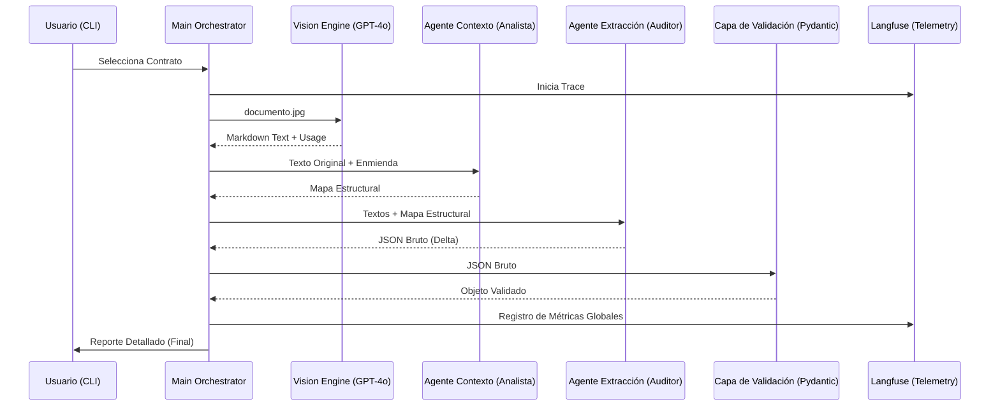

# 
# Documentación Técnica: LegalMove Contract Intelligence

Esta documentación proporciona un análisis técnico profundo de la arquitectura, los componentes y la lógica agéntica de **Auditón**, un pipeline de última generación para el procesamiento de documentos legales.

---

## 🏗️ Arquitectura de Referencia

El sistema utiliza una arquitectura **Pipeline-as-Code** orquestada por agentes inteligentes.



---

## 📄 1. Motor de Visión: OCR Semántico
**Ubicación:** `src/image_parser.py`

A diferencia del OCR tradicional (basado en caracteres), este motor extrae el **significado estructural**.

### Lógica de Codificación
Para que GPT-4o procese imágenes locales, las convertimos a Base64:
```python
def encode_image(image_path):
    with open(image_path, "rb") as image_file:
        return base64.b64encode(image_file.read()).decode('utf-8')
```

### Configuración del Prompt de Visión
El prompt instruye al modelo para actuar como un transcriptor técnico:
> *"Eres un experto en OCR legal. Transcribe el contrato manteniendo la estructura exacta: numeración, títulos de cláusulas y saltos de párrafo. No resumas, no interpretes."*

---

## 🧠 2. Orquestación Multi-Agente

### Etapa 1: Contextualización Estructural
**Ubicación:** `src/agents/contextualization_agent.py`

Este agente resuelve el problema del "diff estructural".
- **Objetivo**: Mapear qué sección del contrato original corresponde a cuál en la enmienda.
- **Diferenciador**: Detecta cambios en la numeración para que el siguiente agente compare "manzanas con manzanas".

### Etapa 2: Auditoría de Extracción (Análisis Delta)
**Ubicación:** `src/agents/extraction_agent.py`

Este es el agente de mayor precisión. Utiliza el mapa del Agente 1 para realizar una comparación profunda.

**Estructura del Prompt Maestro:**
```python
system_prompt = (
    "Eres un Auditor Legal de alta precisión. DEBES clasificar los hallazgos en: "
    "Adiciones, Eliminaciones y Modificaciones. TODA la redacción en ESPAÑOL técnico."
)
```

---

## 🛡️ 3. Validación de Datos (Pydantic V2)
**Ubicación:** `src/models.py`

Para garantizar que la salida de la IA sea apta para producción, utilizamos modelos de datos estrictos.

```python
class SummaryByCategory(BaseModel):
    modificaciones: str
    adiciones: str
    eliminaciones: str

class ContractChangeOutput(BaseModel):
    sections_changed: List[str]
    topics_touched: List[str]
    summary_of_the_change: SummaryByCategory
```

Esta estructura obliga al LLM a separar los cambios, evitando resúmenes ambiguos y facilitando la visualización en dashboards.

---

## 📊 4. Observabilidad y Telemetría
**Ubicación:** `src/main.py` (vía Langfuse)

El sistema implementa observabilidad avanzada para monitorear costos y calidad.

### Registro de Generación (Telemetry)
Cada llamada a la IA registra sus propios metadatos de consumo:
```python
span.update(
    model="gpt-4o",
    usage_details={
        "input": usage["prompt_tokens"],
        "output": usage["completion_tokens"],
        "total": usage["total_tokens"]
    },
    metadata={"contract_type": "SaaS", "stage": "Extraction"}
)
```

### Métricas Agregadas
Al finalizar el pipeline, el orquestador calcula el uso global de tokens y lo inyecta en el **Trace Padre**, permitiendo auditorías de costo por ejecución completa.

---

## ⚙️ 5. Configuración y Confiabilidad

### Variables de Entorno
- `OPENAI_API_KEY`: Motor de inferencia.
- `LANGFUSE_PUBLIC_KEY` / `SECRET_KEY`: Telemetría.
- `LANGFUSE_BASE_URL`: Endpoint de observabilidad.

### Determinismo Legal
El sistema utiliza una temperatura de `0.0` y forzado de JSON (`response_format={"type": "json_object"}`) en los agentes para asegurar que las respuestas sean consistentes, repetibles y libres de alucinaciones creativas.

---
*Documentación generada para el equipo de Ingeniería Legal y Auditoría de IA.*
